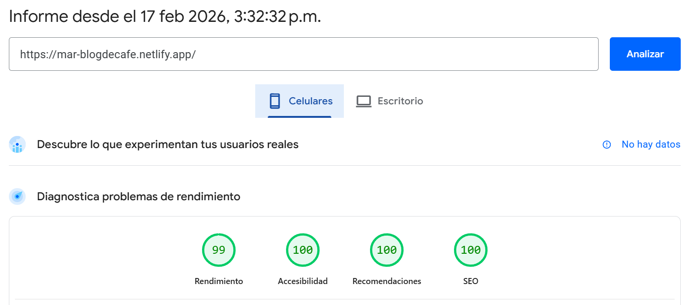
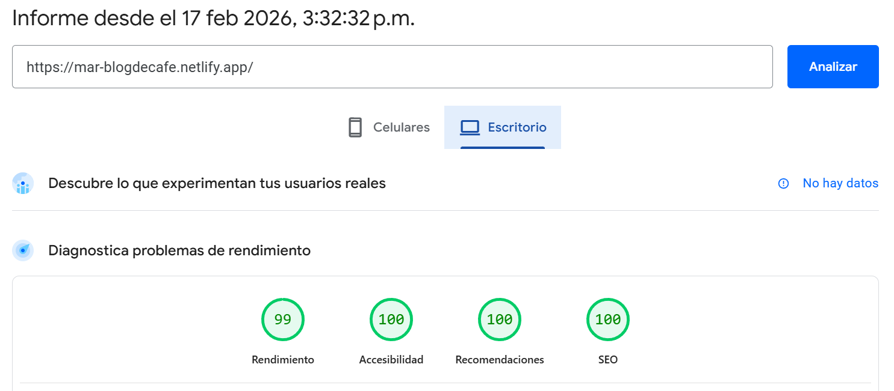

# Blog de café
Un blog sobre café y cursos.
Tercer proyectos del curso de desarrollo web con html, css, js, mysql y php para seguir practicando HTML y CSS.
Adicional, utilicé JS para la validación del formulario de contacto.

## Tecnologías
- HTML
- CSS
- JS

## Performance y SEO
También use este proyecto para ver técnicas para optimizar el performance y el SEO.

- Lazy loading, para las imagenes
- Preload, para lo que se requiere cargar rapidamente
- Prefetch, para cargar la siguiente página que el usuario suele visitar para mejorar su experiencia
- Imágenes .webp, más livianas que otros formatos con la misma calidad
- Etiquetas meta para mejorar el SEO
- Enlaces descriptivos y no solamente "Más informarción" mejora el posicionamiento en google
- Utilización de Lighthouse para auditoría post-deployment

[Link a la auditoría realizada](https://pagespeed.web.dev/analysis/https-mar-blogdecafe-netlify-app/4dp8q77np1?form_factor=mobile&category=performance&category=accessibility&category=best-practices&category=seo&hl=es-419&utm_source=lh-chrome-ext)